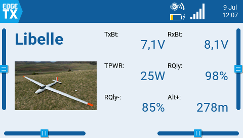
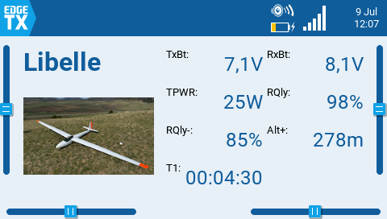
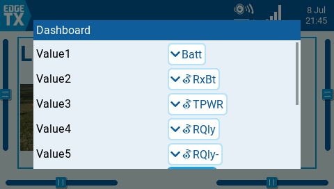

## Dashboard with 6 values in 3 rows

## Dashboard with 7 values in 4 rows

## Dashboard options
The dashboard creates new rows for values automatically. And it stops when the next value option is not configured.

